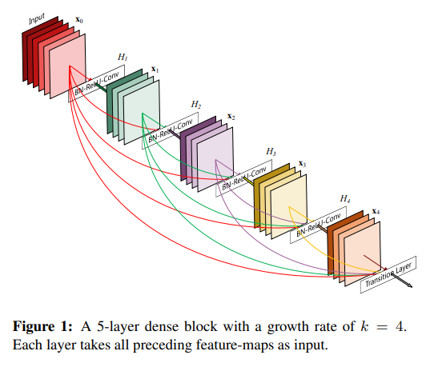
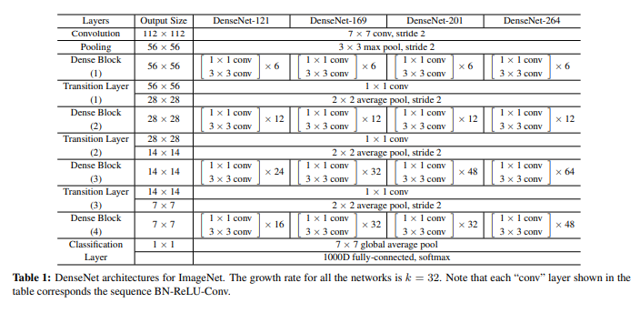
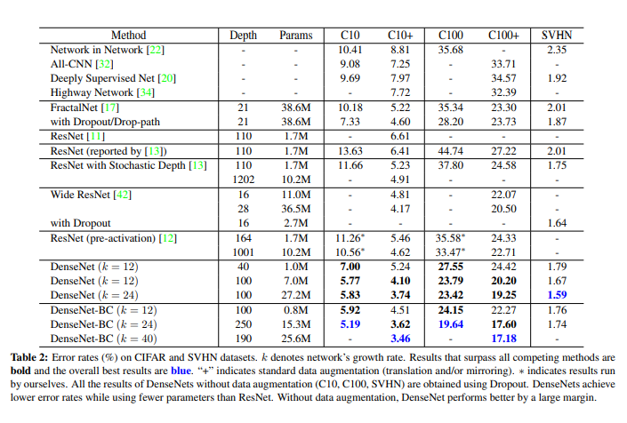

## DenseNet

### Spot of DenseNet

-Dense Block

-Deeper

 paper from [here](hhttps://arxiv.org/abs/1608.06993)

### DenseNet block

### DenseNet structure for Imagenet

### DenseNet's experiment

<a href="structure.md" ><button style="font-size: 20px; color: white; background-color: steelblue; 
height: 50px; border-radius: 10px; " > >>> structure </button></a>

[pytorch implement of DenseNet](./utils/DenseNet_pytorch.py)

[keras implement of DenseNet121](./utils/DenseNet_keras121.py)

[caffe implement of DenseNet](./utils/DenseNet_caffe.prototxt)

