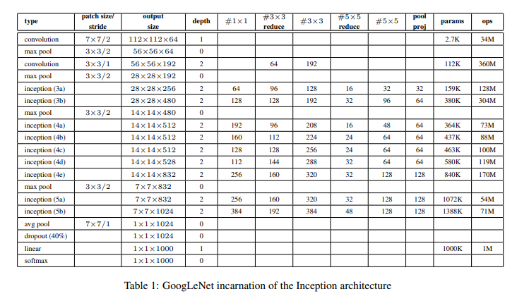

## GoogLeNet

### Spot of GoogLeNet

-Inception

-Replace FC with Max pooling

-Deeper

 paper from [here](https://arxiv.org/abs/1409.4842)

[>>> model structure](http://ethereon.github.io/netscope/#/preset/googlenet)

<a href="structure.md" ><button style="font-size: 20px; color: white; background-color: steelblue; 
height: 50px; border-radius: 10px; " > >>> structure </button></a>

[pytorch implement](./utils/GoogLeNet_pytorch.py)

[keras implement](./utils/GoogLeNet_keras.py)

[caffe implement](./utils/GoogLeNet_caffe.prototxt)
