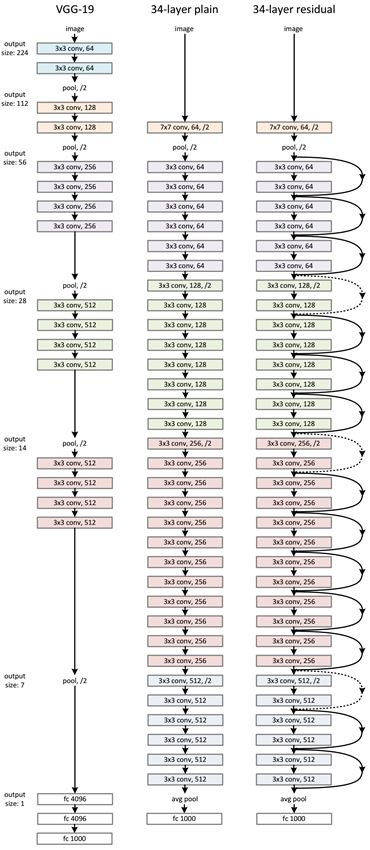

## ResNet

### Spot of ResNet

-More small filter

-Deeper

 paper from [here](https://arxiv.org/abs/1512.03385)

<a href="structure.md" ><button style="font-size: 20px; color: white; background-color: steelblue; 
height: 50px; border-radius: 10px; " > >>> structure </button></a>

[pytorch implement of ResNet](./utils/ResNet_pytorch.py)

[keras implement of ResNet](./utils/ResNet_keras.py)

[caffe implement of ResNet](./utils/ResNet_caffe.prototxt)

