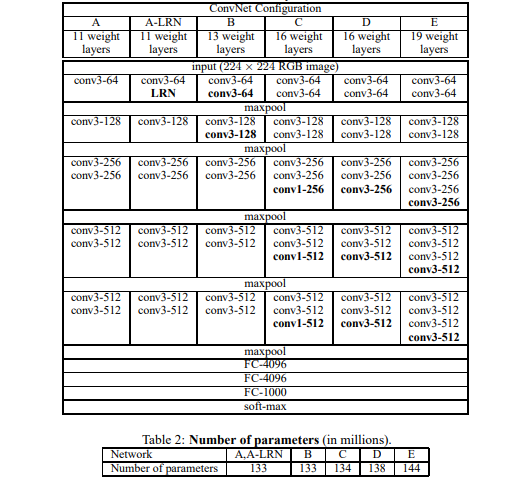

## VGGNet

### Spot of VGGNet

-More small filter

-Deeper

 paper from [here](https://arxiv.org/abs/1409.1556)

[>>> model structure](http://ethereon.github.io/netscope/#/preset/vgg-16)

<a href="structure.md" ><button style="font-size: 20px; color: white; background-color: steelblue; 
height: 50px; border-radius: 10px; " > >>> structure </button></a>

[pytorch implement of VGG16](./utils/VGGNet_pytorch.py)

[keras implement of VGG16](./utils/VGGNet_keras.py)

[caffe implement of VGG16](./utils/VGGNet_caffe.prototxt)

